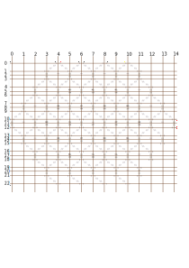
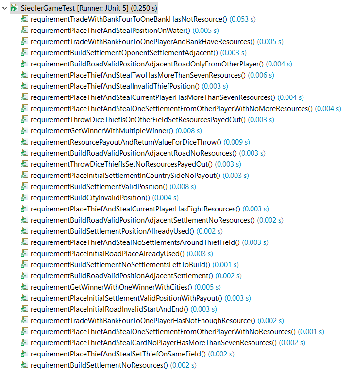
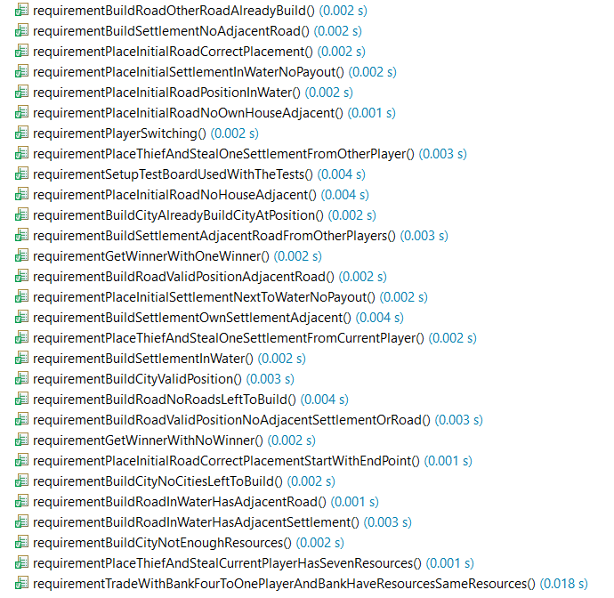

# PM1-IT20taZH-berp-bles-zubj-gruppe3-fischbein-projekt3-catan
Project catan from group fischbein is a multiplayer game. It is based on the original *Siedler von Catan* board game.
It implements a game with 2-4 players where the players play against each other. 
They have the original board with 19 fields to build different structures.
Players can build roads, settlements and cities, where settlements and cities donate points to the players. The first player who reaches 7 points wins the game.

## Siedler Game
### Basic Informations
**How structures are illustrated on the game board**
* ROADS: With the lowercase expression of the player's faction. *Ex.: rr*
* SETTLEMENTS: With the lowercase expression of the player's faction. *Ex.: rr*
* CITIES: With the uppercase expression of the player's faction. *Ex.: RR*

**How much costs the different structures**
* ROADS: one Wood and one Clay.
* SETTLEMENTS: one Wood, one Clay, one Grain and one Wool.
* CITIES: two Grain and three Stone.

Here you can see a view of the coordinates with the valid x-, and y-values for the siedler game.
It also shows you, which resource each field gives to you and which numbers are associated with the different fields.
The fields with the value ~~ are water fields and the field in the middle with the value of -- is the dessert field.
This fields will not give any resources to buildings around them. Water fields are not a valid construction side.

### Start
To start a new game, you have to start the main-method in the class gameController. 
#### Initialize
If you do so, a new window pops out and you are asked, how many players want to play. 
Please enter there a number between 2 and 4. If you have entered the right number, the game starts
and prints out your game board. You can't choose a faction, the game sets it automatically for you.

#### Phase 1: Foundation Phase
##### First Settlement
One after another, the players can set their first settlement at a freely selectable position. The only regulations there are:
* The choosen point has to be a corner of a field on the game board.
* There has to be at least one adjacent resource field around the corner.
* It is necessary, that on the three adjacent corners of the corner, where the player wants to build his settlement, is no other settlement already build. 

They then need to build a road from their settlement to an adjacent corner. The street needs to be directly connected with the settlement and the edge, where
the player wants to build his street needs to be free.
##### Second Settlement
When the last player has build his first settlement, he can directly set his second settlement. It then goes the other way around, until every person
has build two settlements and two roads. The players gain directly after they've build there second settlement resource cards for the adjacent resource fields of the second settlement. The building regulations stay the same as with the first settlement.

#### Phase 2: Playing Phase
After the foundation phase, each player can follow the float chart below for when it's his turn.
The window, where you can enter your commands will lead you through the game. It shows you every time aour available commands and tells you, if your
input is invalid and what you have to correct, to create a valid command.

If you want to have additional informations, you can check the original rule book by clicking on this link: [Original rule book](doc/originalRulebook.pdf). Please mention, that the rules for this game have been slightly changed. The changes are:
* You can not trade with other players.
* You can't choose, from which faction you steal cards, if you can place the thief.
* If a seven is rolled and you have to many cards, the resources to throw away are selected randomly.

## Class Diagramm
Below, you can find the class diagramm for the siedler project. It shows you all our classes and their datafields and methods.

## Test Protocol
In the pdf you can find all information about the junit tests for the siedlerGame.java class.

you can find the pdf her: 
[Siedler Game test documentation](https://github.zhaw.ch/PM1-IT20taZH-berp-bles-zubj/gruppe3-fischbein-projekt3-catan/blob/master/doc/testing/testing-siedlerGame-documentation.pdf)

### Screenshots

